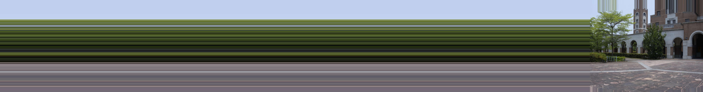
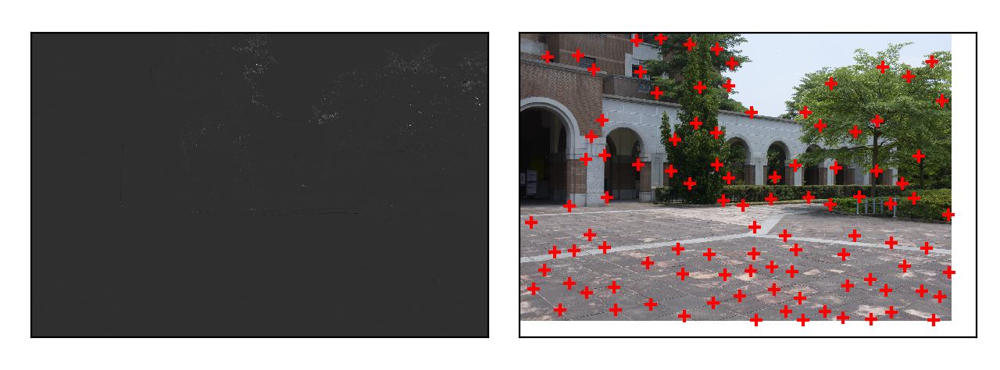
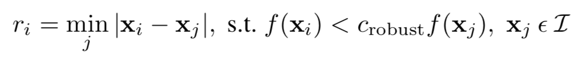
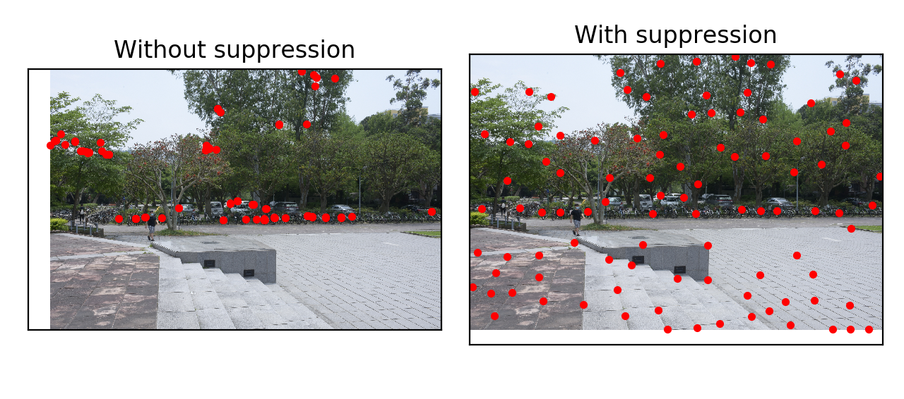
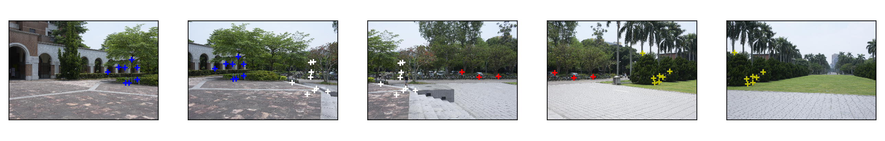
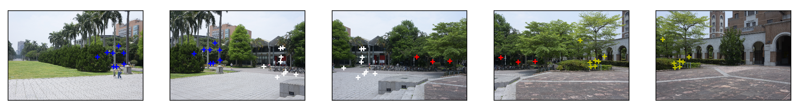

# VFX Project 2 : Image Stitching 

## 作者

- 電機三 趙崇皓 B06901104

- 電機三 黃彥翔 B06901170

## 檔案架構

- `lib`：自己的函式庫
  - `features/`：和 feature detection, matching 有關的ｍodule
    - `detection`：實作 Harris corner detection, descriptors, non-maximal suppression 等等
    - `matching`：實作 feature matching
  - `stitch`：實作 ransac, image stitching
  - `warp`：和 cylindrical projection, image translation 有關的函式
  - `utils`：其他輔助函式
- `runs`：裡面的每一個資料夾都代表一組測試照片。一個資料夾的內容有：
  - `detection/`：原始影像特徵點座標以及 descriptor
  - `images/`：輸入原始影像
  - `warped/`：原始影響圓柱投影
  - `shift.pickle`：紀錄兩兩影像的 translation 變換
  - `result.jpg`：最終接合影像

## 執行方式

在 terminal 上執行：

```
$ ./run.sh
```

見 `run.sh`：

```
python3 main.py 4 5000 lib1 --use_cache
```

主程式要傳入三個參數：

- `ratio`：影像 downsample scale。因為原始影像很大（6000 * 4000）會處理有點久，所以我們執行時都是 downsample 四倍。
- `f`：焦距。這組測試照片要用 5000。
- `run`：指定哪一組測試照片（也就是 `runs`中的子資料夾）。我們是使用 `lib1`這組總圖的照片。
- ` —use_cache`：是否使用 precomputed features and warped images。因為圖片很大，所以建議測試時可以加這個 flag，讓程式用我們已經算過一次的 features 開始做 stitching，不然程式會從頭重新做一次 feature detection, matching, cylindrical projection。當然，也可以不加這個 flag，不過就要等一陣子。

## 結果

首先看看我們十張照片接合的結果。



影像大小大概是 1000 * 8000。

## 實作過程

這次作業可以分成以下幾個步驟：

1. Feature detection and description：
   1. Harris corner detector and description
   2. Non-maximal suppression
2. Feature matching
3. Compute pairwise image alignment
   1. Translation model
   2. RANSAC
4. Stitching and blending 

以下分別說明。

### Feature detection



我們實作了 harris corner detection得到特徵點（上圖右），基本上就是使用投影片的方法，針對圖像中每一點計算 corner response（上圖左），並且設定一個 threshold 濾掉較低的 response。接著我們就實作 **Multi-Image Matching using Multi-Scale Oriented Patches** 這篇中提到的 **adaptive non-maximal suppression**，來解決特徵點 clustering 的問題。



這個演算法會針對每一個特徵點，計算一個 suppresion radius，也就是相鄰 corner response 大於自己並且最近的特徵點的距離。我們選擇 suppresion radius 最大的 500 個特徵點來當作最後的特徵點，這可以讓特徵點平均散佈於影像中。



### Feature description

得到特徵點之後，我們選取特徵點周圍 20 * 20 的 patch 然後 downsample 成 8 * 8，並 flatten 成一個 64 為向量，作為這個特徵點的表示法。

### Feature Matching

得到每一張圖的特徵點向量以後，就可以針對兩張圖進行 feature matching。我們 matching 的方式如下：

1. 計算兩張圖 A, B 特徵點兩兩距離（Euclidean distance），並且最短距離關係要是 mutual，也就是若 （a, b)是A, B兩圖 match 的特徵點，則 b 需要是 B所有特徵點中距離 a 最近的，a 也需要是 A 中所有特徵點距離 b 最近。
2. 設定一個 threshold，濾掉距離大於這個 threshold 的幾組特徵點。
3. 針對每一組特徵點，計算 next closest feature。舉例 (a, b) 這組特徵點，找 B 中距離 a 第二近的 b' ，則我們希望 |a - b| / |a - b'| 小於一個 threshold。直觀上來講，如果 (a, b) 是一個好的 match，則 a 和第二近的 b' 的距離應該要遠大於 a 和 b 的距離。利用這個 threshold 可以再濾掉不夠好的 match。

如此一來我們可以得到特徵點的對應。





如上圖所示，相鄰照片中同色的點就是一組特徵點對應。

### Pairwise Alignment


### Image Stitching and Blending

我們得到圖片兩兩之間的位移之後，就可以開始進行接合。

由於我們在上一步 算出的是兩張相鄰的圖片間的位移，要將全部的照片接合需要先計算一個 global y shift。從最左邊的照片開始往右，將照片的 y 方向位移一直向累加，就可以得到每一張照片對於**第一張照片**的 y 方向位移。接著，我們將全部的位移減去當中最小的位移，讓全部照片的基準點對齊 y = 0 的位置。

下面的例子代表第三張照片對齊 y = 0, 其他照片向下位移 dy。

```
[1, 3, -2, 4, -1] -> 減去 -2 -> [3, 5, 0, 6, 1] 
```

我們知道全部照片的 y shift 以後，就可以將全部的照片按照自己的 dy 向下位移，並且再將每一個照片都 pad 到一樣高。這邊建議用 edge mode 的 padding，如果單純用黑色到時候 blending 會不好看。

至於 x shift 會影響到 blending，作法一樣是從左往右處理，然後維護一個 global x shift，每次都多接合一個新的影像並在邊界處用投影片提到的基本 decreasing / increasing alpha blending 方法，最後就可以接合全部的影像。